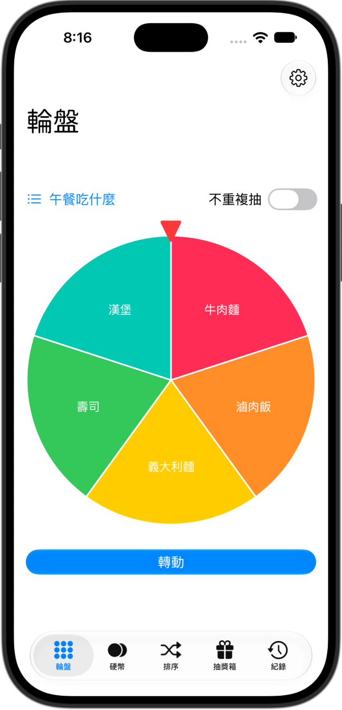
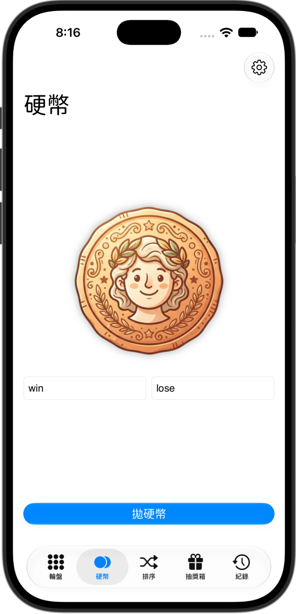

<div align="center">

# 🎲 randomToolBox

**A playful all-in-one random decision toolbox for iOS — spin a wheel, flip a coin, shuffle a list, or draw a prize.**

[](#)
[](#)
[](#)
[](#)
[](#)
[](#)

<p float="left">
  
  
</p>

**[English](#-english)** · **[中文](#-中文)**

</div>

---

## 🇬🇧 English

> ⚠️ The app UI is currently Traditional Chinese only. An English localization is planned but not yet implemented.

### ✨ Features

- 🎡 **Wheel** — Spin a colorful wheel to pick one option from a custom list, with an optional "no repeat" mode so drawn items won't come up again.
- 🪙 **Coin Flip** — Flip a coin between two custom labels (e.g. `win` / `lose`).
- 🔀 **Shuffle** — Randomly reorder a list of items.
- 🎁 **Lottery Box** — Draw prizes/items from a pool, great for giveaways or random assignments.
- 🕒 **History** — Every draw is automatically saved so you can review past results.
- 📋 **Custom Lists** — Create, edit, and manage your own option lists (with per-item weights) that are shared across all the tools.

### 🛠 Tech Stack

- **SwiftUI** for the entire UI, built with a `TabView`-based navigation.
- **SwiftData** for persisting option lists and draw history.
- Custom rounded font (`GenSenRounded2TW`) for a friendly look and feel.

### 📁 Project Structure

```
randomToolBox/
├── Coin/            🪙 Coin flip feature
├── Wheel/           🎡 Spin wheel feature + spin engine
├── Shuffle/         🔀 Shuffle feature
├── Lottery/         🎁 Lottery box feature
├── History/         🕒 Draw history feature
├── Settings/        ⚙️ List manager, editor & picker
├── Model/           🧠 SwiftData models & random engine
├── Fonts/           🔤 Custom fonts
└── Assets.xcassets  🎨 App assets
```

### 🚀 Getting Started

1. Open `randomToolBox.xcodeproj` in Xcode.
2. Select an iOS 27+ simulator or device.
3. Build & run (`⌘R`).

### 📋 Requirements

- Xcode (latest)
- iOS 27.0+

---

## 🇹🇼 中文

> ⚠️ 目前 App 介面僅支援繁體中文，英文版尚未實作，未來會補上。

### ✨ 功能特色

- 🎡 **輪盤** — 轉動繽紛輪盤，從自訂清單中抽出一個項目，並支援「不重複抽」模式，抽過的項目不會再出現。
- 🪙 **硬幣** — 自訂兩個標籤（例如 `win` / `lose`）進行拋硬幣。
- 🔀 **排序** — 將清單項目隨機打亂順序。
- 🎁 **抽獎箱** — 從獎品/項目池中抽獎，適合活動抽獎或隨機分配。
- 🕒 **紀錄** — 自動保存每一次抽取結果，方便回顧歷史紀錄。
- 📋 **自訂清單** — 建立、編輯與管理自己的選項清單（支援每個項目的權重），並在各工具間共用。

### 🛠 技術架構

- 整個介面以 **SwiftUI** 打造，採用 `TabView` 分頁導覽。
- 使用 **SwiftData** 儲存選項清單與抽取紀錄。
- 使用客製化圓體字型（`GenSenRounded2TW`），呈現親切可愛的視覺風格。

### 📁 專案結構

```
randomToolBox/
├── Coin/            🪙 硬幣功能
├── Wheel/           🎡 輪盤功能與轉動邏輯
├── Shuffle/         🔀 排序功能
├── Lottery/         🎁 抽獎箱功能
├── History/         🕒 抽取紀錄功能
├── Settings/        ⚙️ 清單管理、編輯與選擇器
├── Model/           🧠 SwiftData 資料模型與隨機邏輯
├── Fonts/           🔤 自訂字型
└── Assets.xcassets  🎨 App 素材資源
```

### 🚀 快速開始

1. 使用 Xcode 開啟 `randomToolBox.xcodeproj`。
2. 選擇 iOS 27 以上的模擬器或實機。
3. 建置並執行（`⌘R`）。

### 📋 系統需求

- 最新版 Xcode
- iOS 27.0 以上

---

<div align="center">

Made with ❤️ using SwiftUI

</div>
